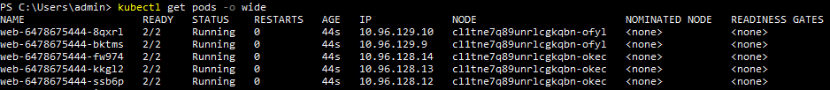
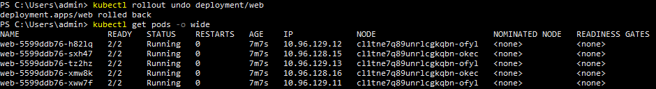
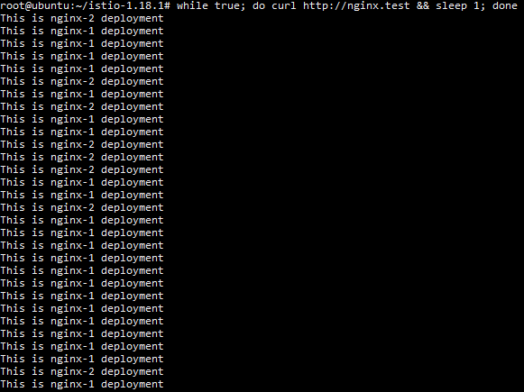

# Домашнее задание к занятию «Обновление приложений»

1. Так как новые версии не совместимы со старыми. Я бы предложил Canary с постепенным переходом пользователей на новую версию. Т.к. запас мощности только 20%, начать с минимального количества подов новой версии. Параллельно с тем как пользователи будут переходить на новую версию убирать часть подов старой версии и добавлять такое же количество новой версии. После полного перехода пользователей на новую версию отключить старую.

2. Из [Kubernetes manifest файла](./files/deployment.yaml) развёрнут deployment с multitool и nginx:  
     
   Для того чтобы приложение максимально быстро развернулось, но при этом было доступно до момента запуска новой версии в manifest файл были добавлены следующие строчки:  
   ```
   strategy:
     type: RollingUpdate
     rollingUpdate:
       maxSurge: 100%
       maxUnavailable: 0%
   ```
   Обновление nginx до версии 1.20:  
     
   Как можно увидеть из вывода команды сначала были созданы поды с новой версией приложение и только после запуска подов с новой версией начали удаляться поды со старой версией.  

   Попытка обновить nginx до версии 1.28:  
     
   Как можно видеть новые поды с новой версией упали в ошибку при попытке запуска. При этом поды со старой версией по прежнему работают.

   Быстрый откат на предыдущую версию при помощи команды ```kubectl rollout undo deployment/web```:  
     
   После выполнения команды поды с новой, несуществующей, версией nginx были удалены, а поды с предыдущей, рабочей, остались нетронутыми.

3. При помощи [kubernetes manifest файла](./files/deployment-canary.yaml) развёрнуты 2 деплоймента c nginx (один отвечает сообщением ```This is nginx-1 deployment```, второй ```This is nginx-2 deployment```), сервис направляющий к ним трафик, а также абстракции istio (Gateway, VirtualService и DestinationRule):  
     
   Вывод curl подтверждающий что часть трафика уходит на nginx с сообщением ```This is nginx-2 deployment```:  
   
   